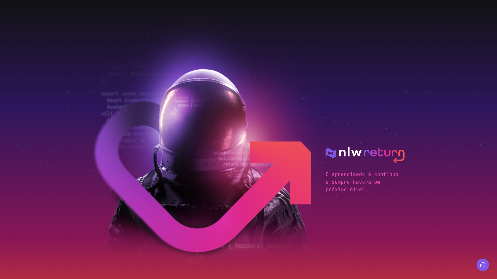
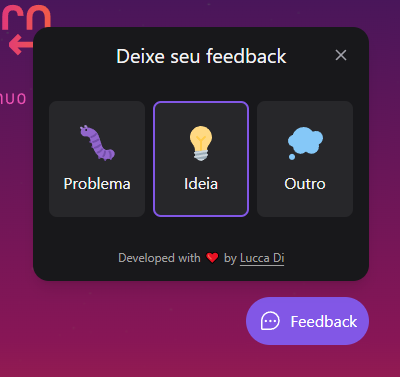
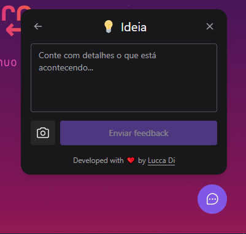
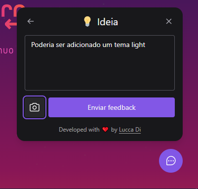
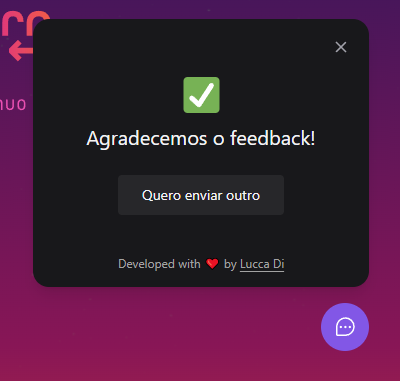

<h1 align="center">🚀 Feedget 🚀</h1>

<p align="center">
  
  
  
</p>

<p align="center">
  <a href="#-project">Project</a> |
  <a href="#-technologies">Technologies</a> |
  <a href="#-features">Features</a> |
  <a href="#-getting-started">Getting started</a> |
  <a href="#-license">License</a>
</p>


<p style="display: flex" >
  
  
  
  
  
</p>


## 💻 Project

Web version of a feedback widget application, dubbed "Feedget", which can be added to any mobile or web environment.

The user chooses a type of feedback to be sent, after that a description is requested for the feedback and optionally the user can automatically add a screenshot, after sending the feedback will be registered in the database and an email will be automatically sent to the owner from the website.

Project developed during Rocketseat's Next Level Week Return

Acesse a aplicação em funcionamento: https://feedget-app.vercel.app

API: [Feedback Widget (API)](https://github.com/LuccaDi/feedback-widget-api)

Mobile version: [Feedback Widget (Mobile)](https://github.com/LuccaDi/feedback-widget-mobile)


## 🚀 Technologies

- [ReactJS](https://reactjs.org/)
- [Tailwind CSS](https://tailwindcss.com/)
- [Vite](https://vitejs.dev/)
- [Headless UI](https://headlessui.dev/)
- [Phosphor Icons](https://phosphoricons.com)
- [html2canvas](https://html2canvas.hertzen.com)
- [Axios](https://axios-http.com/ptbr/)


## 🛠 Features 

✔️ Send text feedback
  
✔️ Button to send automatic screenshot, requiring no other user action

✔️ Automatic emailing to website/app developer

✔️ Possibility of sending a new feedback at the end

🛠️ Dark and light theme

🚧 Dashboard to track the feedbacks received


## 🏁 Getting started

### Requirements

- [Node.js](https://nodejs.org/en/)
- [Yarn](https://classic.yarnpkg.com/) or [npm](https://www.npmjs.com/package/npm)


**Clone the project and access the folder**

```bash
git clone https://github.com/LuccaDi/feedback-widget-web.git && cd feedback-widget-web
```


**Follow the steps below**

### Web

**Make sure you have the server running** (or you will only be able to see the front-end, the application will not work)

To clone the server and run it, go to [Feedback Widget (API)](https://github.com/LuccaDi/feedback-widget-api)


```bash
# Install the dependencies
$ npm install

# Make a copy of '.env.local.example' to '.env.local'
$ cp .env.local.example .env.local

# Start the application
$ npm run dev
```

## 📝 License

This project is licensed under the MIT License - see the [LICENSE](LICENSE) file for details.

---

<p align="center">
  Made with 💜 by <a href="https://www.linkedin.com/in/luccadi/">Lucca Di Bastiani</a>
</p>
